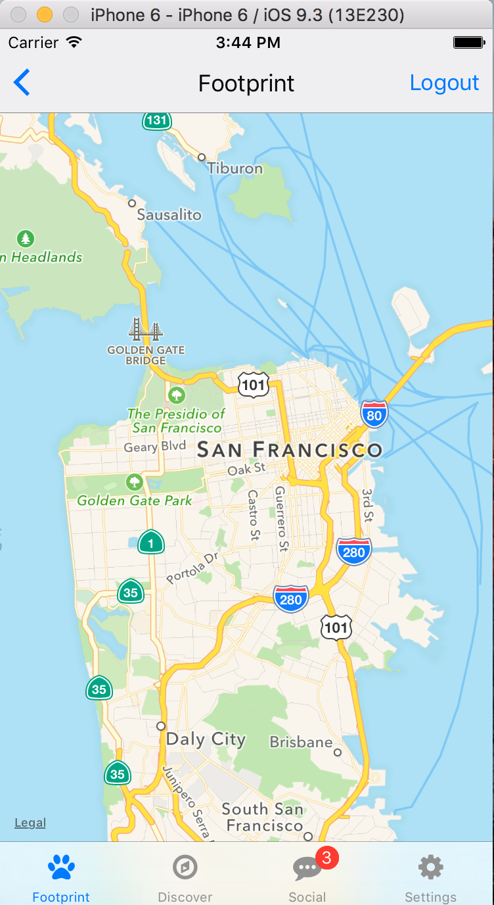

## My Footprint

 - My Footprint is a mobile lifestyle app that tracks where users 
 spend their time and helps them expand their footprint by getting 
 to know new people and places around them.

 - Have you ever asked yourself:
 - How much of my city do I really enjoy?
 - Why do I always run into the same people?
 - Why don't I ever exerience something new?
 - What am I missing out on?

  

#### Tools Used
 - [React-Native](https://facebook.github.io/react-native/)
 - [React-Native-Router-Flux](https://github.com/aksonov/react-native-router-flux)
 - [React-Native-Simple-Store](https://github.com/jasonmerino/react-native-simple-store)
 - [React-Native-Material-Kit](https://github.com/xinthink/react-native-material-kit)
 - [React-Native-Vector-Icons](https://github.com/oblador/react-native-vector-icons)
 - [React-Redux](https://github.com/reactjs/react-redux)
 - [Redux](https://github.com/reactjs/redux)
 - [Redux-Logger](https://github.com/evgenyrodionov/redux-logger)
 - [Redux-Thunk](https://github.com/gaearon/redux-thunk)
 - [lodash](https://lodash.com/)